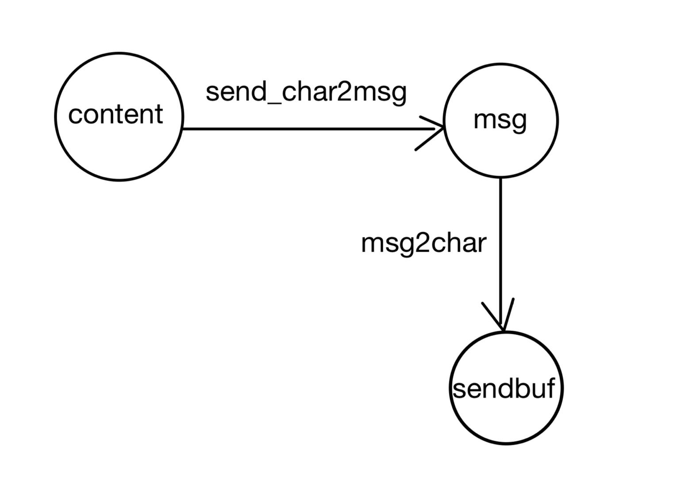
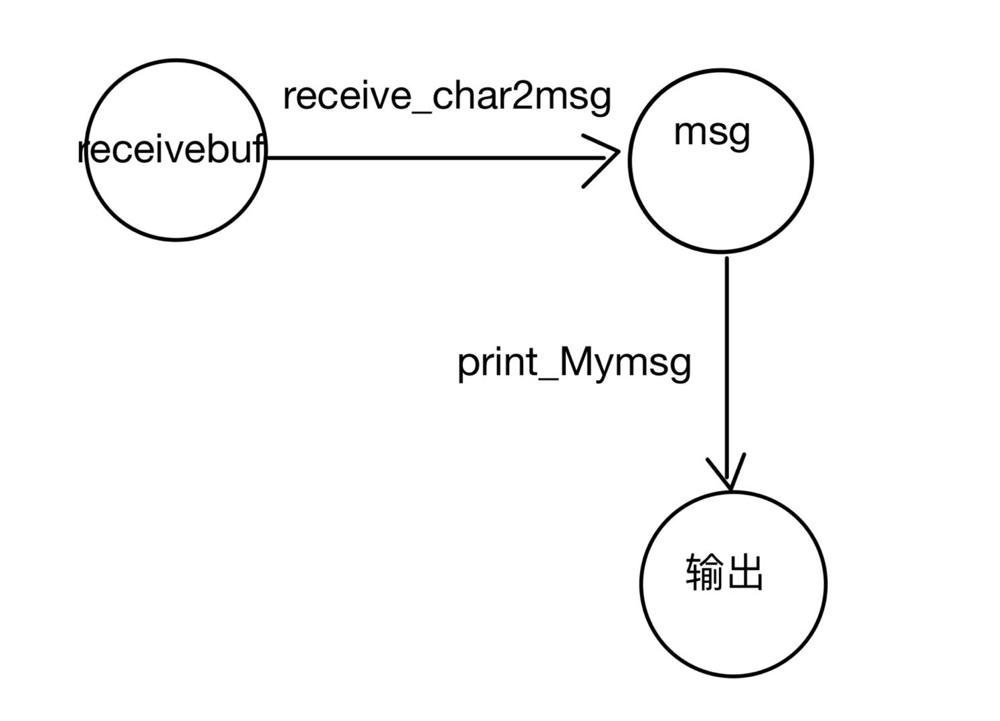
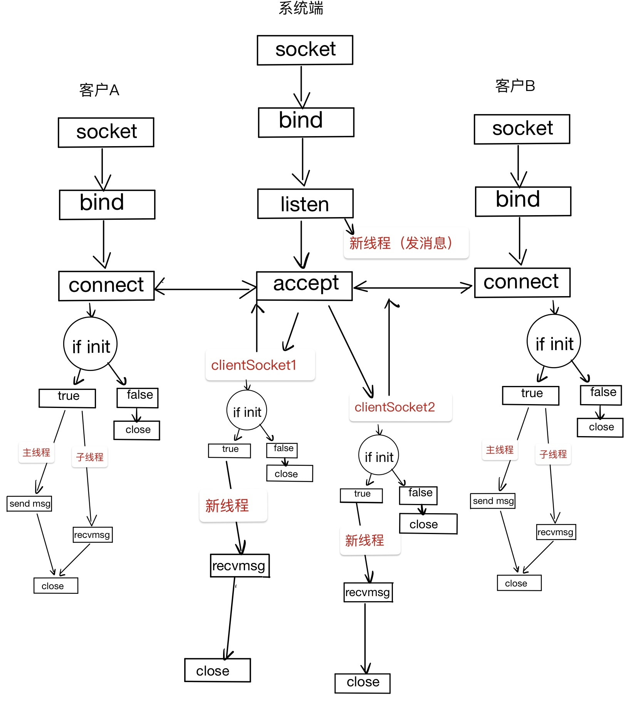
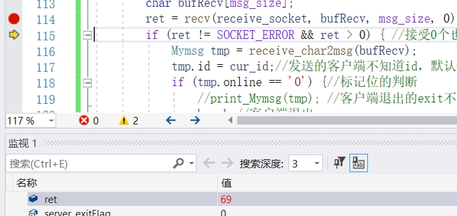
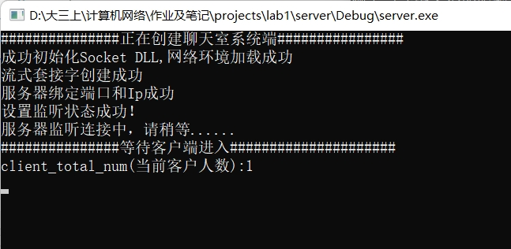
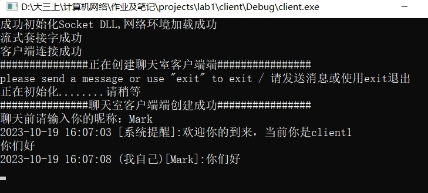
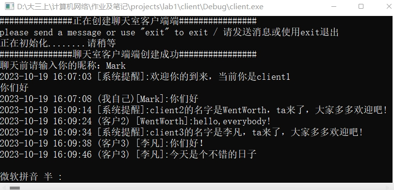
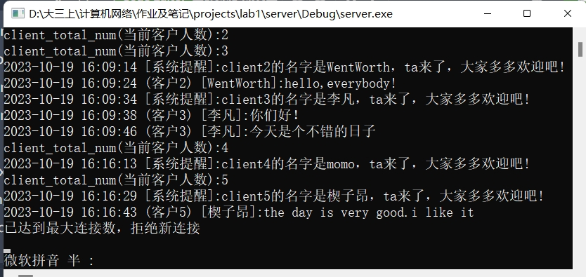
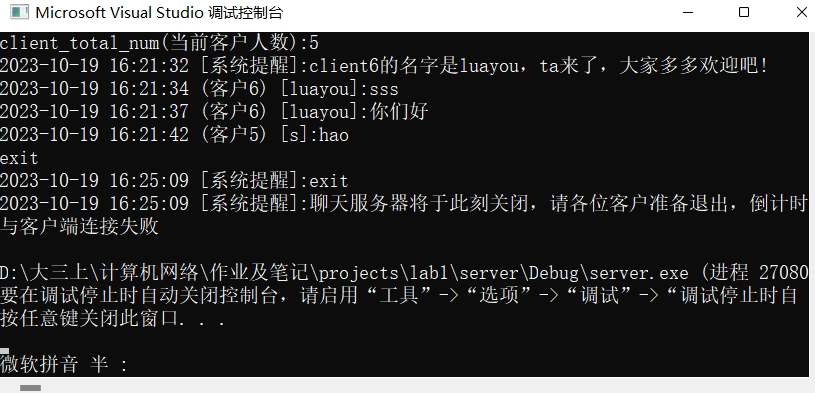

  
****

****

  


年 月 日

# 协议设计

## 相关原理

**网络协议**

1.  语义。语义是解释控制信息每个部分的意义。它规定了需要发出何种控制信息，以及完成的动作与做出什么样的响应。

2.  语法。语法是用户数据与控制信息的结构与格式，以及数据出现的顺序。

3.  时序。时序是对事件发生顺序的详细说明。（也可称为“同步”）。

**Socket**

- Stream Sockets

  流式套接字，也称为TCP套接字，是一种面向连接的套接字类型。它提供了可靠的、双向的、基于字节流的通信方式。流式套接字使用TCP（传输控制协议）作为底层协议。确保数据按顺序到达，且没有丢失。

- Datagram Sockets

  数据报套接字，也称为UDP套接字，是一种无连接的套接字类型。它使用UDP（用户数据报协议）作为底层协议。不需要建立连接，可以直接发送数据包，没有顺序。

## 总体实现

基于上述原理，在这次实验我实现了如下的聊天协议:

- 采取流式套接字(stream sockets)，所以我们的底层协议是基于TCP的，而TCP协议是一种可靠的协议，确保数据按照发送的顺序到达目的地，而且不会丢失。这确保我们的聊天程序的消息顺序是按序的，而且聊天消息传输与发送是可靠的。

- 聊天消息的结构是自定义的结构体Mymsg类型，里面有$id$,$name$,$online$,$Time$,$content$相关变量，对应着消息发送者的id标识符，发送者名字，发送者在线与否，发送时间，发送内容。经过封装，我们的发送消息前面加上了消息头，同时限制一条消息的大小为1080字节。而在消息头中包含有关数据的信息，可以让接收方更有效地处理数据。

- 在聊天中设计了系统端与客户端。其中聊天程序由一个系统端提供服务，有多个聊天程序同时聊天，为了避免过多程序同时聊天，这里设置了聊天数量的限制，即同时聊天数目最大为5人。其中，客户端的聊天是通过服务端的消息转发实现的。

- 时序为按序的。由于底层采取流式套接字，说明是基于TCP进行数据传输的，显然发送消息是按序发送的，按序接受。

- 这里为了标识每个客户的id，昵称，限制客户数量大小。在客户建立连接时会有一个初始阶段，这个阶段系统端会发给客户端一个2字节的数据。char ifinit\[2\]，第一位标识用户的数量是否超过最大限制，第二位标识用户的ID。如果第一位判断后，用户数量未超过限制，对应客户端会提示输入昵称；而相应地，系统端会创建线程，在起始处接受用户昵称。而在此初始阶段结束后，会开始用封装的消息进行通信。

- 设计系统与客户端退出的协议。当输入消息"exit"后，会调用exit自动退出，同时会有几秒钟的延时设置。这里系统可以终止服务，同时客户端可以退出在线模式，二者的方式都是输入"exit"。

- 打印输出消息采取特定的函数，在其中检查了消息的合法性，避免了打印错误消息。针对本人发送的消息，在本人界面显现出 Time (我自己)\[昵称\]:Message；而针对他人发送消息，显现 Time (客户ID)\[昵称\]:Message。其中Time代表发送时间，Message表示发送消息内容。

### 消息类型

**结构体设计**

这里我设计了客户端与服务端之间信息交互的消息格式，定义了Mymsg结构体,如下图所示。


这里先详细介绍一下Mymsg中各个属性值的含义。其中$id$代表发送消息者的id，这里为0代表\[系统提醒\]的发送，不为0代表客户端的id值。而$name$代表消息发送者的名字，其中系统端名字设为默认——系统提醒。而$online$代表该客户是否发送"exit"退出，如果退出，那么online为"0",会直接将该客户端退出；如果系统端online为"0"，代表系统终止服务，会强制将所有客户端退出；若为"1"，代表在线，继续接受消息/发送消息即可。最后$Time$是发送消息的时间，直接在封装Msg时提取时间即可。

**消息的发送与接受流程**

由于我们使用的是流式套接字，在其中消息的接受函数与发送函数是recv、send。这两个函数中第二个参数传送的数据是以字节为单位传输，以char\*格式传送。因此在传送自定义消息类型时，需要用到相关的转换函数。

因此，这里我们的消息发送与接受流程，如下图设计所示:





在图[2](#fig:4)中，很明显可以看出消息发送的流程。

- 首先对发送内容进行封装。将char数组(限制最大1024字节)，转换为msg，msg结构体中包含一些额外的标识信息。

- 然后由于采取的套接字发送函数是send，需要将msg转为char\*再继续发送。这里转换采取的是$memcpy$，直接将字节数拷贝，稳定可靠。

在图[3](#fig:5)中，可以看到消息的接受流程。

- 首先我们$recv$函数收到的是$char* receivebuf$。要对收到的字节数进行转换。

- 然后调用函数$receive\_char2msg$，运用memcpy直接将字节数拷贝到一个msg结构体，这样就得到了对应的消息msg。

- 最后调用特定的输出函数$print\_Mymsg$，用特定的格式打印一个msg。

### 时序分析

这里服务端与客户端的连接，以及服务端客户端收发消息的时序逻辑进行如下的分析。



如上图，由于我们的聊天室有限制人数的功能，这里的时序逻辑在tcp的基础上进行相关改进。在这里增加了一个$if\_init$的控制信号。具体作用是当进行新的连接时，得到了新的socket，这个时候先判断聊天室人数，如果超过限制，服务端控制$if \_init$信号，将信号发送给对应客户端，同时等待1秒后将此socket关闭。

而客户端在connet成功后，还需要进行控制信号的recv操作，如果$if\_init$信号为false，直接将socket关闭，退出即可，并在屏幕上显示相关信息。

如果没有超过限制数，那么与正常tcp时序逻辑一致，只不过在这里我们增加了一个新的线程用来发送系统端的消息。在客户端连接申请后，系统端接受并同意，创建新的socket负责此客户端，同时建立新的线程，这里新线程用来接受此客户端消息，并转发给其他客户端。

# 代码思路以及功能分析

## 消息的处理

**1.消息结构体定义**

``` c++
#define msg_size 1080  //封装的Mymsg的字节大小
#define content_size 1024//发送消息的最大大小
#define idMax 100
//封装消息的结构体
struct Mymsg {
    int id; //标识符
    char name[31];//昵称限制在31字节内
    char online;//判断是否在线
    char Time[20];//发送消息的时间
    char content[1024];//发送内容
};//1080字节
```

**2.消息Msg转为char\***

``` c++
//需要把封装的message转化为char去发送
char* msg2char(Mymsg message) {
    char temp[msg_size];
    memcpy(temp, &message, sizeof(Mymsg));//直接将字节数拷贝
    return temp;
}
```

**3.封装内容为一条Msg**

这里是将发送的内容封装成一条Msg，首先直接将具体内容拷贝，然后获取现在的时间，将其转为字符串写入Msg，最后判断消息内容是否为exit，如果是exit，将online位置’1’，否则置’0’。

``` c++
//把消息内容封装成message
Mymsg send_char2msg(char* content, int _id, char* _name) {
    Mymsg temp;
    strcpy_s(temp.content, content);//消息内容复制
    char timeStr[20] = { 0 };
    time_t t = time(0);
    strftime(timeStr, sizeof(timeStr), "%Y-%m-%d %H:%M:%S", localtime(&t));
    strcpy(temp.Time, timeStr);
    
    //判断content是否为exit
    if (strcmp(content, "exit") == 0) {
        temp.online = '0';//不在线
    }
    else {
        temp.online = '1';
    }
    memcpy(&temp, &_id, sizeof(int));
    strcpy(temp.name, _name);
    return temp;//返回封装好的message
}
```

**4.将接受的buf转为msg**

``` c++
//接收的char*转为message
Mymsg receive_char2msg(char* receive_buf) {
    Mymsg temp;
    memcpy(&temp, receive_buf, sizeof(Mymsg));
    return temp;
}
```

**5.打印输出消息**

``` c++
//格式输出
void print_Mymsg(Mymsg t) {
    if (t.id == 0) {
        cout << t.Time << " " << "[" << t.name << "]:" << t.content << endl;
    }
    else if (t.id >= 1 && t.id <= idMax) { 
    //虽然总数只有5个，但是id可能为100，这里设置了一个较为合理的值
        cout << t.Time << " (客户" << t.id << ") [" << t.name << "]:" 
        << t.content << endl;
    }
    else {}
}
```

## 服务器端

### 发消息进程

这里设置了系统也可以发消息，因此创建了一个发消息的进程，具体作用是系统输入，将输入消息发送给所有客户，如果系统发送的是exit，那么会提醒系统终止服务。

- 首先函数通过传递给线程的参数，获取到serverSocket值，通过此socket发送消息。

- 获取系统端输入的内容。将内容封装成send_msg传输。

- 判断服务器发送的消息是否为"exit",如果是exit，最后传输一句话，提醒客户端，服务器要终止。将这句话传输并在服务器打印后，先睡眠5秒钟。这里是为了让处理客户端通信的socket先行关闭，然后最后关闭server_socket，释放资源后退出。

``` c++
//系统提醒的消息发送
DWORD WINAPI ThreadSend(LPVOID lpParameter) {
    SOCKET send_socket = (SOCKET)lpParameter;
    int ret = 0;
    while (1) {
        char bufsend[content_size] = { 0 };
        cin.getline(bufsend, content_size);
        Mymsg send_msg = send_char2msg(bufsend, 0, server_name);
        print_Mymsg(send_msg);
        for (auto i : client)
            ret = send(i.first, msg2char(send_msg), msg_size, 0);
        //判断服务器是否终止
        if (send_msg.online == '0') {
            server_exitFlag = 1;
            string str2 = "聊天服务器将于此刻关闭，请各位客户准备退出，倒计时5秒";
            char* p = (char*)str2.data();
            Mymsg tmp = send_char2msg(p, 0, server_name);
            for (auto i : client)
                ret = send(i.first, msg2char(tmp), msg_size, 0);
            //强制退出
            print_Mymsg(tmp);
            Sleep(5000);//让所有接受进程释放掉receive_socket
            closesocket(send_socket);//send_socket是server_socket
            WSACleanup();
            exit(100);
        }
    }
    return 0;
}
```

### 处理客户端消息进程

这里为每个客户端创建了一个线程，线程函数负责处理该客户的相关消息与信息的传送。

1.  首先记录当前客户id，储存昵称。

2.  对新来的客户发送欢迎消息。这里设置对已经到场的用户、当前新来的用户，不同的欢迎词。

3.  进入while循环，开始循环接受此客户发来的消息。接受成功则打印此消息，并且把消息转发给所有客户。

4.  如果接受失败那么退出循环。如果是系统端终止服务引起的客户退出，这里清除socket直接返回即可；如果是客户端退出/掉线等等原因导致，这里先删去此用户，并向所有用户广播该客户的退出。

``` c++
//服务端接受消息的线程函数 负责转发消息给所有客户
DWORD WINAPI ThreadReceive(LPVOID lpParameter) {
    int cur_id = client_id;//当前Id
    SOCKET receive_socket = (SOCKET)lpParameter;
    //1.储存昵称
    char cur_clientName[31] = { 0 };//客户的名称
    int ret = recv(receive_socket, cur_clientName, 31, 0);
    if (ret == SOCKET_ERROR || ret <= 0) {//初始化client时出错
        closesocket(receive_socket);
        return 0;
    }
    client[receive_socket] = string(cur_clientName);//储存昵称

    //初始化完成，现在开始用封装的Msg传递信息
    //2.系统发送欢迎消息
    string stemp1 = (string)"client" + to_string(cur_id) + (string)"的名字是" 
    + client[receive_socket] + (string)"，ta来了，大家多多欢迎吧!";
    string stemp2 = (string)"欢迎你的到来，当前你是client" + 
    to_string(cur_id);//针对当前用户欢迎词不一样

    char* welcome1 = (char*)stemp1.data();//欢迎语句
    Mymsg first_wel1 = send_char2msg(welcome1, 0, server_name);//封装成Mymsg
    char* welcome2 = (char*)stemp2.data();//欢迎语句
    Mymsg first_wel2 = send_char2msg(welcome2, 0, server_name);//封装成Mymsg
    for (auto i : client) {
        if (i.first == receive_socket)
            send(i.first, msg2char(first_wel2), sizeof(Mymsg), 0);
        else
            send(i.first, msg2char(first_wel1), sizeof(Mymsg), 0);
    }
    print_Mymsg(first_wel1);//系统端也打印
    ret = 0;

    //3.开始循环接受此client消息
    while (1) {
        char bufRecv[msg_size];
        ret = recv(receive_socket, bufRecv, msg_size, 0);
        if (ret != SOCKET_ERROR && ret > 0) { //接受0个也代表客户端退出
            Mymsg tmp = receive_char2msg(bufRecv);
            tmp.id = cur_id;//发送的客户端不知道id，默认0，这里要修改
            if (tmp.online == '0') {//标记位的判断
                //print_Mymsg(tmp); //客户端退出的exit不打印
                break;//客户端退出
            }
            else {
                print_Mymsg(tmp);
                for (auto i : client)
                    send(i.first, msg2char(tmp), msg_size, 0);//直接把收到的转发即可
            }
        }
        else {
            break;//同样标识为客户端退出
        }
    }
    if (server_exitFlag) {//系统发送退出消息
        closesocket(receive_socket);
        return 0;//直接退出此线程，善后工作在发送进程中
    }
    //客户退出，同步给其余所有人
    string str2 = (string)"离开了聊天室！";
    char* p = (char*)str2.data();
    map<SOCKET, string>::iterator iter = client.find(receive_socket);
    client.erase(iter);//退出聊天室，要把client记录的映射关系删掉
    client_total_num--;//注意id不会减少，只减少总数
    //离开的成员自动发送消息(客户端代替转发)
    Mymsg exit_client = send_char2msg(p, cur_id, cur_clientName);
    print_Mymsg(exit_client);
    for (auto i : client)
        send(i.first, msg2char(exit_client), msg_size, 0);
    closesocket(receive_socket);//把这个客户端的进程关掉即可
    return 0;//准备退出此线程

}
```

### server中的main函数

**1.前期工作**

- 首先初始化$winsock2$库，检查初始化是否成功

- 创建服务器套接字$serverSocket$，绑定ip与端口号

- 设置监听状态，以便接受客户端请求

``` c++
cout << "###############正在创建聊天室系统端################" << endl;
// 加载winsock环境
WSAData  wsaData;
if (WSAStartup(MAKEWORD(2, 2), &wsaData) != 0) {
    cout << "初始化Socket DLL失败!" << endl;
    return 0;
}
else
    cout << "成功初始化Socket DLL,网络环境加载成功" << endl;

// 创建套接字
serverSocket = socket(AF_INET, SOCK_STREAM, 0);//使用流式套接字 基于TCP的按顺序
if (serverSocket == INVALID_SOCKET) {
    cout << "流式套接字创建失败" << endl;
    WSACleanup();
}
else
    cout << "流式套接字创建成功" << endl;

// 给服务器的套接字绑定ip地址和端口：bind函数
serverAddr.sin_family = AF_INET;
serverAddr.sin_port = htons(8000);
serverAddr.sin_addr.s_addr = inet_addr("127.0.0.1");

int len = sizeof(sockaddr_in);
if (bind(serverSocket, (SOCKADDR*)&serverAddr, len) == SOCKET_ERROR) {
    cout << "服务器绑定端口和ip失败" << endl;
    WSACleanup();
}
else {
    cout << "服务器绑定端口和Ip成功" << endl;
}
// 监听端口
if (listen(serverSocket, MaxClient) != 0) {
    cout << "设置监听状态失败！" << endl;
    WSACleanup();//结束使用Socket，释放socket dll资源
}
else
    cout << "设置监听状态成功！" << endl;

cout << "服务器监听连接中，请稍等......" << endl;
cout << "###############等待客户端进入#####################" << endl;
```

**2.接受客户端的请求**

- 首先创立一个线程，用于服务器端发送消息

- 进入while循环，不断处理客户端的连接请求。

- 如果连接数大于$MaxClient$，将ifinit第1位置’0’，发送给对应客户端，等待1秒它接受信息，随后关闭此socket，复原相关计数器，$continue$返回循环起始处。

- 如果连接数正常。那么将ifinit的第2位置为对应客户端Id，发送此消息即可完成初始化。然后为此客户创立对应的新线程，用于处理该线程发送的消息。

``` c++
 // 创建一个线程，用于服务器发送消息
CloseHandle(CreateThread(NULL, 0, ThreadSend, (LPVOID)serverSocket, 0, NULL));

// 循环接受：客户端发来的连接
while (1) {

    sockaddr_in clientAddr;//新建当前client的地址
    len = sizeof(sockaddr_in);
    //创建新的客户端的套接字
    SOCKET cur_clientSocket = accept(serverSocket, (sockaddr*)&clientAddr, &len);
    if (cur_clientSocket == INVALID_SOCKET) { 
        cout << "与客户端连接失败" << endl;
        closesocket(cur_clientSocket);
        WSACleanup();
        return 0;
    }
    client_total_num++;//客户总数++，客户端连接到套接字 
    client_id++;//id++

    //ifinit作为成功连接的判断符号
    // 如果当前连接的客户端数量已经达到6个，则关闭新连接并继续等待下一个连接请求
    char ifinit[2] = { '1','0' };
    if (client_total_num > MaxClient) {
        cout << "已达到最大连接数，拒绝新连接" << endl;
        ifinit[0] = '0';
        send(cur_clientSocket, ifinit, 2, 0);//传递给客户端的标识符，用作初始的符号
        Sleep(1000);//等待1秒
        closesocket(cur_clientSocket);
        client_total_num--;//还原
        client_id--;//id也要还原
        continue;
    }
    else {
        ifinit[1] = client_id + '0' - 0;
        send(cur_clientSocket, ifinit, 2, 0);
    }
    cout << "client_total_num(当前客户人数):" << client_total_num << endl;

    HANDLE hthread2 = CreateThread(NULL, 0, ThreadReceive, 
    (LPVOID)cur_clientSocket, 0, NULL);//创建线程用于接受该客户端消息
    //在线程函数里面再建立client的映射关系
    if (hthread2 == NULL)//线程创建失败
    {
        perror("The Thread is failed!\n");
        exit(EXIT_FAILURE);
    }
    else
    {
        CloseHandle(hthread2);
    }

}
// 关闭主socket连接，释放资源
closesocket(serverSocket);
WSACleanup();
return 0;
```

## 客户端

### 接受消息进程

这里为一个客户端创立了一个新线程，用于接受服务器传来的消息。这个消息可能是服务器转发的消息，也可能是服务器主动发送的消息。

- 首先注意这里接受的缓冲区字节数一定是固定的msg_size，防止读取数据出错。

- 判断读取的字节数是否正确。不正确那么退出程序。

- 如果正确，将收到的缓冲区字节转为一条msg。如果这条msg是系统发送的，并且系统要退出，那么先接受最后一条消息，在打印完后，睡眠2s，关闭资源后让程序退出。

``` c++
//这里创建一个子进程来收客户端消息即可，主进程用来发消息
DWORD WINAPI ThreadReceive() {
    int ret = 0;
    while (1) {
        char bufrecv[msg_size] = { 0 }; //用来接受数据
        ret = recv(clientSocket, bufrecv, msg_size, 0);
        if (ret == SOCKET_ERROR || ret <= 0) {
            cout << "连接错误！2s后退出" << endl;
            Sleep(2000);
            closesocket(clientSocket);
            WSACleanup();
            exit(100); //强制所有线程全部退出
        }
        Mymsg temp = receive_char2msg(bufrecv);

        if (temp.id == 0) {
            if (temp.online == '0') {//系统端要退出
                char exitMessage[msg_size] = { 0 };
                recv(clientSocket, exitMessage, msg_size, 0);
                print_Mymsg(receive_char2msg(exitMessage));//打印exitMessage后退出
                Sleep(2000);
                closesocket(clientSocket);//释放资源
                WSACleanup();
                exit(100);//由于系统端终止，强制客户端退出
                //break;
            }
        }
        //说明服务器没有终止，打印msg
        print_Mymsg(temp);
    }
    return 0;
}
```

### client中的main函数

这里main函数为主线程，充当发消息的功能。

**1.前期工作**

- 初始化winsock2库，创建客户套接字$clientSocket$，连接客户端。

- 接受服务器发送的2字节控制信号，如果$ifinit[0]$为’0’，说明创建失败，释放资源后直接退出；如果为’1’，创建成功，读取$ifinit[1]$为ID号。

- 创建成功后，输入昵称。这里固定了输入昵称最大31字节。

``` c++
........//前面连接的代码与server中的类似，就不放代码了
cout << "###############正在创建聊天室客户端端################" << endl;
cout << "please send a message or use \"exit\" to exit / 请发送消息或使用exit退出" << endl;
cout << "正在初始化........请稍等" << endl;

char ifinit[2];//初始2bit，判断是否成功
recv(clientSocket, ifinit, 2, 0);
if (ifinit[0] == '0') {
    cout << "###########聊天室客户端端创建失败，倒计时3秒退出############" << endl;
    Sleep(3000);//倒计时三秒
    closesocket(clientSocket);
    WSACleanup();
    return 0;
}
else {
    cur_clientID = ifinit[1] + 0 - '0';
    cout << "###############聊天室客户端端创建成功################" << endl;
}
// 发送和接受数据即可
string name;
cout << "聊天前请输入你的昵称：";
getline(cin, name); // 读入一整行，可以有空格
char* client_name = (char*)name.data();
int ret = send(clientSocket, name.data(), 31, 0);//和server匹配，31字节
if (ret == SOCKET_ERROR || ret <= 0) {
    cout << "连接错误！3s后退出";
    // 关闭连接，释放资源
    Sleep(3000);
    closesocket(clientSocket);
    WSACleanup();
    return 0;
}
```

**2.发送消息**

- 首先创立一个子线程，用于接受客户端发送/转发的消息。

- 然后主线程去发送消息。这里先从客户端读取输入的内容，封装成msg去发送。如果此条消息为"exit"，打印自动退出的提醒，然后主线程释放资源，程序关闭。

``` c++
 // 初始化全部完成，这里开始使用封装的msg传递信息
ret = 0;
//创建子线程
CloseHandle(CreateThread(NULL, 0, (LPTHREAD_START_ROUTINE)ThreadReceive, NULL, 0, NULL));
//在线程函数里面再建立client的映射关系
while (1) {

    char bufrecv[1024] = { 0 };
    cin.getline(bufrecv, 1024);
    Mymsg temp = send_char2msg(bufrecv, 0, client_name);
    //这里的0不是id，只是默认传参，在服务端传的时候会知道id

    ret = send(clientSocket, msg2char(temp), msg_size, 0);
    //print_Mymsg(temp);  接受服务器发送的再打印，这个时候才能获得id
    if (ret == SOCKET_ERROR || ret <= 0) {
        cout << "发送消息失败!程序在3秒后退出" << endl;
        Sleep(3000);
        break;
    }
    else {
        if (temp.online == '0') {
            cout << "自动提醒：客户端" << client_name << "在3秒后退出" << endl;
            Sleep(3000);
            break;
        }
    }

}
// 关闭连接，释放资源
closesocket(clientSocket);
WSACleanup();
return 0;
```

# 实验思考以及问题分析

在这次实验中遇到了一些问题，比如多打印了一句话，或者打印出"烫烫烫...."字符。经过研究并分析、测试发现是因为:

发送消息与接收消息的字节大小不匹配！由于我开始时会提醒用户输入昵称，而这里如果client.cpp中发送的大小是100，而server对应接受的昵称字节大小为31，就会有69个字节没有被接受，那么它会等到下一轮继续发送，这样server就会虚假的接收到下一条消息，但是client并没有发送消息。

``` c++
client:
string name;
cout << "聊天前请输入你的昵称：";
getline(cin, name); // 读入一整行，可以有空格
char* client_name = (char*)name.data();
int ret = send(clientSocket, name.data(), 100, 0);//和server匹配，31字节
......
server:
char cur_clientName[31] = { 0 };//客户的名称
int ret = recv(receive_socket, cur_clientName, 31, 0);
```

结果如下所示


调试的证据:



因此，在程序中send与recv时要额外注意字节数大小的对应。如果大小没有对应上，会造成程序乱码的输出。而经过此问题的分析，我重新检查了字节数发送与接受的对应，程序正确了。

# 程序展示与验证

**1.server的启动**

可以看到输出一系列日志消息，以及当前系统中客户的人数。



**2.client的启动**

可以看到初始化完成后，接收到系统的提醒消息，而且自己发送消息有(我自己)的标识符。



**3.客户的对话**

可以看到中英文都没有数据的丢失，正常进行中英文对话。




**4.客户端人数限制**

超过5人时，可以看到客户端会自动退出。




**5.程序正确的退出方式**

可以看到客户端使用exit后，自动退出


系统端使用exit后，强制所有客户以及系统窗口一起退出


